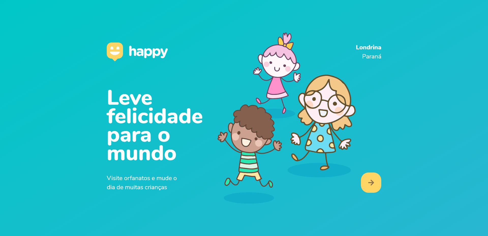

# Happy

Happy is an application that will connect orphanages and their visitors to bring happiness to the orphanages' children. 

## How to use?

Use the map to search an orphanage near you and get all the informations to visit them and make the children happy.

For the orphanages, register your location and informations by clicking on the plus sign.

### READ ME
This is a project developed in the Discovery trail of RocketSeat's Next Level Week event. It was an intense course of 5 days straight of coding and learning. 
It was my first time creating a full application from the front-end to the back-end. I learned a lot of things about how a page is created and how to organize all the files in a project, dividing them by their functions inside the application. 
Now the challenge is to modify it and add some new funcionalities to improve it and make it better.